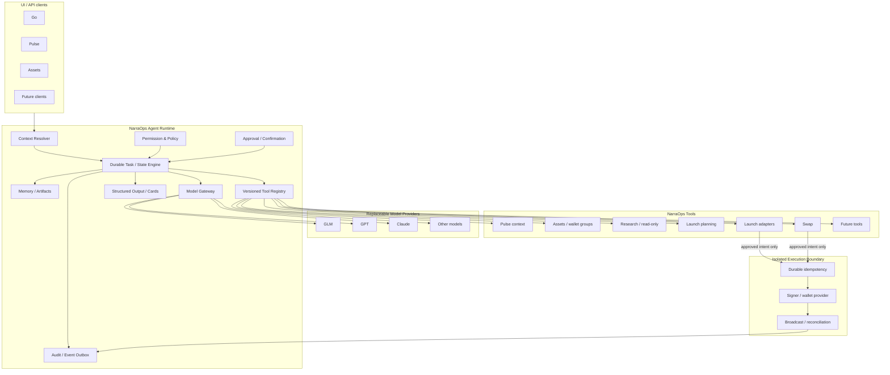
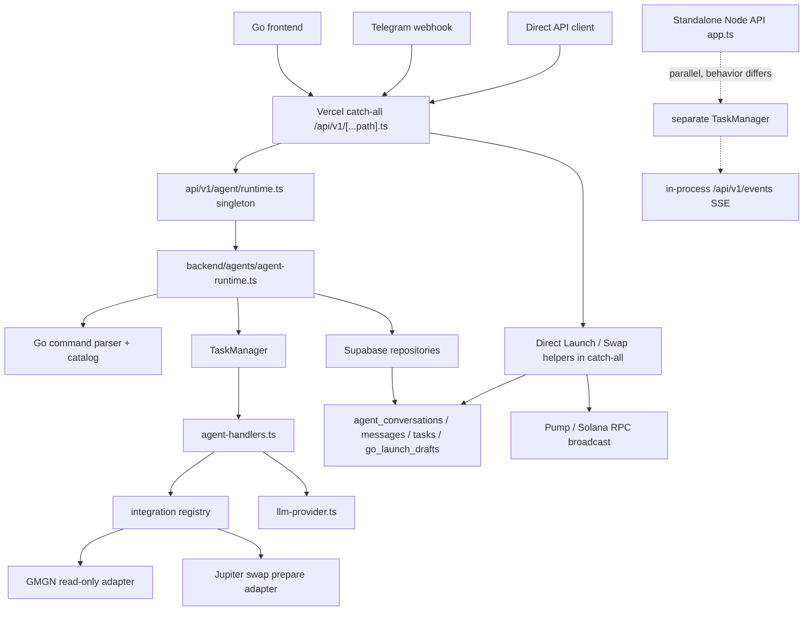
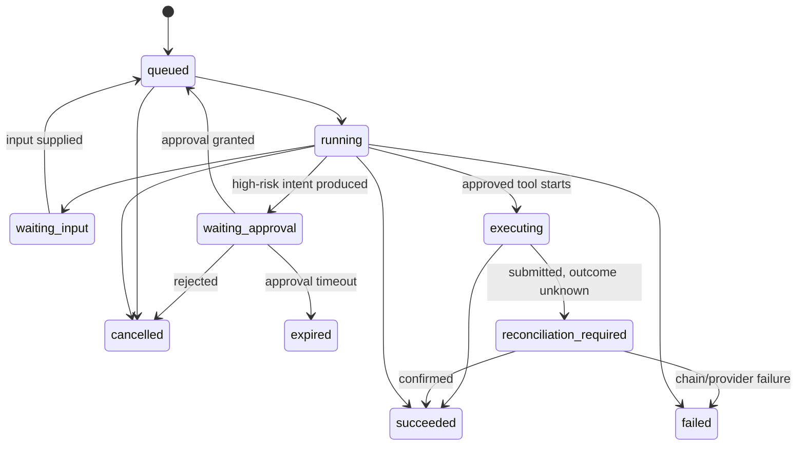
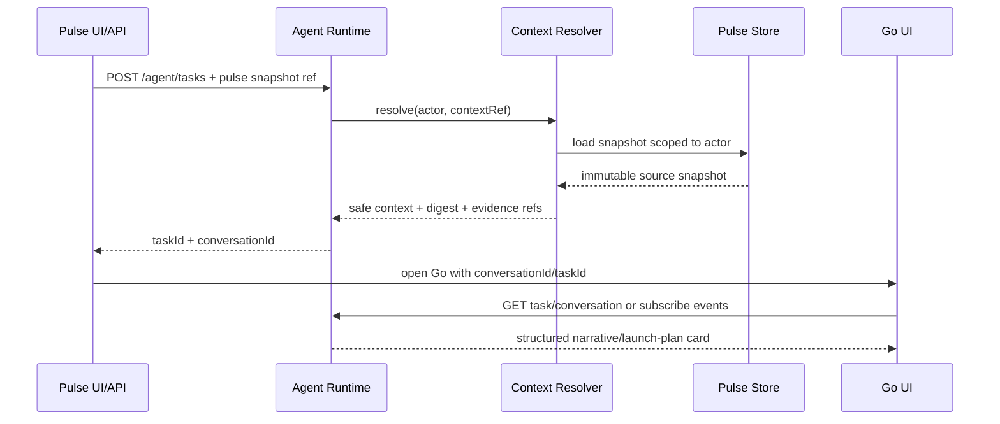

# NarraOps Agent 独立系统能力：架构审计与设计

> 状态：第一阶段设计稿，等待确认  
> 日期：2026-08-09  
> 范围：只读审计现有 Go、Agent runtime、structured cards、task state、SSE、Pulse、Assets、Launch / Swap；本报告不授权实现或重构。

## 0. 结论

当前仓库已经存在一个可复用的 Agent 雏形：`createAgentRuntime`、`TaskManager`、conversation/task/draft repository、structured cards、Supabase 持久化、GMGN/Jupiter/Launch adapters，以及 Web/Telegram/API channel 入口。它足以作为 NarraOps Agent Runtime 的迁移起点，暂时不需要 LangGraph、CrewAI 或第二套编排框架。

但当前实现仍是“Go 后端能力集合”，还不是独立的 NarraOps Agent 系统能力：

- Runtime、Go command parser、LLM、业务 handlers、数据库查询和工具适配器直接互相引用。
- `requires_confirmation` 目前主要是描述性 metadata，不是 Runtime 强制执行的策略。
- Tool Registry 只是一个方法集合，没有稳定的 tool schema、版本、风险等级、权限和审计契约。
- Task 只有 `queued/running/succeeded/failed/cancelled`；`needs_input`、`blocked`、`waiting_approval` 被包装在成功结果里。
- Approval 没有独立的持久化实体；Launch、Swap、Transfer 的确认方式和执行状态不统一。
- SSE 事件只保存在进程内；Vercel 生产 catch-all 没有对应 SSE 路由，前端当前主要同步等待或轮询。
- OpenAPI、JSON Schema、独立 Node API、Vercel API 和实际 card/task 类型已经明显漂移。
- Model Provider 是直接读取环境变量的 OpenAI-compatible helper，不是可替换的 provider interface。

推荐方向是：保留现有行为，通过 facade、adapter 和双写逐步抽出 `backend/agent-runtime/`，让 Go、Pulse、Assets 和未来 API 都调用同一 Runtime；把资金执行作为 Runtime 之外的受控 Tool/Execution Boundary，通过持久化 approval、intent digest、idempotency 和 audit 串联。

### 0.1 目标 Architecture Diagram



模型只能向 Runtime 返回文本、structured output 或 proposed tool call。只有 Runtime 能解析 context、验证 schema、评估 policy、创建 approval 和调用 tool；只有 Execution Boundary 能签名与广播。

---

## 1. 当前 Agent 架构实际是什么

### 1.1 实际运行链路



这不是一条完全统一的链路，而是两套部分重叠的服务入口：

1. Vercel 生产路径使用 `api/v1/[...path].ts` + bundle 后的 `api/v1/agent/runtime.ts`。
2. 独立 Node API 使用 `backend/api/src/app.ts`，自己创建 repositories、TaskManager、handlers 和 SSE。

两者共享部分代码，但路由、安全校验、Launch 执行方式、持久化和事件能力并不完全相同。

### 1.2 关键文件

| 范围 | 当前关键文件 | 作用 / 现状 |
|---|---|---|
| Runtime facade | `backend/agents/agent-runtime.ts` | channel-agnostic 会话入口、task 创建、同步等待、回复生成、card 返回 |
| Task orchestration | `backend/agents/task-manager.ts` | 进程内执行 handler、更新 task、发出 EventEmitter 事件 |
| Intent parsing | `backend/agents/go-command-parser.ts` | slash command 与正则自然语言意图分类；命名和规则属于 Go |
| Capability catalog | `backend/agents/go-command-catalog.ts` | task type、confirmation flag、execution mode |
| Business handlers | `backend/agents/agent-handlers.ts` | narrative、meme、launch draft、market、trade plan/confirm 等业务集中实现 |
| Model helper | `backend/agents/llm-provider.ts` | OpenAI-compatible chat completion、结构化 launch 内容与 fallback |
| Tool-like registry | `backend/integrations/registry.ts` | GMGN 和 Jupiter 方法集合；不是 schema 驱动的 Tool Registry |
| Read-only market | `backend/integrations/gmgn-market-adapter.ts` | GMGN CLI read-only 市场与 token 分析 |
| Swap prepare | `backend/integrations/solana-swap-adapter.ts` | Jupiter quote + unsigned transaction preparation |
| Public source | `backend/integrations/narrative-link-adapter.ts` | public link fetch、SSRF/size/timeout 边界、metadata extraction |
| Launch catalog | `backend/integrations/launch-platform-registry.ts` | Pump/FourMeme/Pons capability metadata |
| Vercel Agent adapter | `api/v1/agent/runtime.ts` | singleton runtime、Supabase/Assets repository 注入、Telegram adapter |
| Production API | `api/v1/[...path].ts` | auth、Pulse、Assets、Agent、launch draft、Launch/Swap 签名提交和广播混合入口 |
| Standalone API | `backend/api/src/app.ts` | 独立 HTTP API 与进程内 SSE；和 Vercel 路由存在漂移 |
| Durable repositories | `backend/api/src/repositories/supabase-agent-repositories.ts` | conversation/message/task/go launch draft persistence |
| Assets read adapter | `backend/api/src/repositories/supabase-wallet-group-repository.ts` | Agent 只读列出用户 wallet groups / public addresses |
| Agent migration | `database/migrations/021_go_agent_core.sql` | 当前 durable Agent core 表 |
| Pulse user snapshot | `database/migrations/019_pulse_narrative_user_state.sql` | Pulse `Use` 后的私有、用户归属 snapshot |
| Structured contracts | `shared/openapi.yaml`, `shared/schemas/*.json` | 名义 source of truth；实际已落后于代码 |
| Frontend Agent client | `frontend/src/app.ts` | Go conversation、cards、launch edits、浏览器签名与提交 |
| Execution core | `backend/execution/*` | idempotency/audit 原型、signer、chain adapters、launch/follow-buy |
| Launch coordinator | `backend/api/src/launch-execution-coordinator.ts` | prepare、confirmation token、sign/broadcast、reconciliation、bound buy |

---

## 2. 当前 Go、Agent、GLM / Model 的耦合

### 2.1 Go 与 Agent 的耦合

- parser、command catalog、launch draft schema 和数据库表带有 `go-*` / `go_*` 命名。
- `validateConversationCreate/Message` 默认 `currentView = "go"`。
- launch draft 的 public API 位于 `/api/v1/go/launch-drafts/*`。
- Runtime 直接 import API validation、API repositories 和 Go command parser。
- frontend 维护 `narraops.go.conversationId`，并在 Go 内做额外的本地 trivial chat、wallet status 分支。
- Pulse → Go 仍有一条独立 `/api/v1/go/plan` builder 路径，没有统一进入 Agent context resolver 和 task protocol。
- Launch/Swap 执行提交 schema 使用 `go.launch_execution.v1` / `go.swap_execution.v1`。

结论：UI channel 已经部分可替换，但核心命名、协议和部分业务入口仍以 Go 为中心。

### 2.2 Agent 与 Model 的耦合

- `agent-handlers.ts` 直接调用 `generateStructuredLaunchContent`。
- Runtime 在 task 完成后直接调用 `generateAgentReply`。
- provider helper 自己读取 `OPENAI_*` / `LLM_*` 环境变量并直接调用 `/chat/completions`。
- provider identity 固定为 `openai_compatible`；没有 provider capability negotiation、model policy、usage、retry class、structured-output contract 或 provider-specific adapter。
- task result 最多以 bounded JSON 直接传给模型，缺少由 Tool/Card 定义的 model-safe projection。

仓库当前并未硬编码 `GLM` 类名，但“OpenAI-compatible HTTP helper”本身仍是业务代码依赖。若 GLM、GPT、Claude 的协议或能力不同，当前业务层需要跟着修改。

### 2.3 Agent 与数据库 / Tool 的耦合

- Runtime 内部直接构造 Supabase-backed narrative repository，并直接查询 `pulse_narrative_candidates`。
- handlers 依赖松散的 `services` object 和 `integrations` method bag，没有编译期 Tool contract。
- tool input/output 没有统一 JSON Schema；风险、权限、超时、重试、side-effect 等信息分散在代码中。
- `// @ts-nocheck` 覆盖核心 Agent 文件，进一步削弱了接口边界。

LLM 当前没有直接数据库连接，也没有私钥，这是正确的；但 Runtime 和 handlers 仍绕过统一 Tool boundary 直接访问 repository。

---

## 3. 可以保留的现有能力

### 3.1 直接保留并包裹

- `TaskManager` 的基本 create/run/get 结构。
- conversation、message、task、launch draft repository interface 及 Supabase 实现。
- structured card 的返回模式：`{ type, status?, data }`。
- Web / Telegram / API channel adapter 的总体方向。
- GMGN read-only adapter。
- public link reader 的 SSRF、redirect、timeout、size、content-type 限制。
- Jupiter quote + unsigned transaction preparation。
- Pump/FourMeme/Pons launch planning adapters。
- Assets wallet-group read model：只返回 group metadata 与 public address。
- execution layer 已有的 transaction digest、signature verification、chain submission 和 confirmation reconciliation代码。
- recursive secret rejection/redaction。
- decimal string、submitted ≠ confirmed、user-owned resource scoping等既有约束。

### 3.2 保留思想、替换实现

- `requires_confirmation`：保留语义，但改为 Runtime/Policy 强制状态转换。
- `GO_COMMANDS`：作为 compatibility alias 保留，权威定义迁到 Tool Registry。
- in-memory fallback：仅保留 test/dev adapter，生产不得自动退回。
- SSE event types：保留兼容 event name，同时写入 durable outbox/event store。
- launch draft：保留实体和 UI，但从 `go_launch_drafts` 逐步抽象为 Agent-owned artifact。
- current LLM fallback：保留为 deterministic responder，但放进 `ModelProvider` / `ResponseComposer` 边界。

---

## 4. 需要抽成独立 NarraOps Agent Runtime 的部分

1. **Runtime API**：conversation、message、task、artifact、approval、event。
2. **Context Resolver**：把 Pulse/Assets/client references 解析成最小、可授权、可审计 context。
3. **Task Engine**：持久化状态机、lease、resume、cancel、retry。
4. **Tool Registry**：固定 schema、版本、risk、permissions、side-effect、timeout。
5. **Policy Engine**：actor/resource/tenant/tool/risk 参数验证；不能只信 task metadata。
6. **Approval Service**：独立 durable approval，绑定 actor + exact intent digest + resource version + expiry。
7. **Execution Gateway**：所有 Launch/Swap/Transfer 通过统一边界；Runtime 不签名、不广播。
8. **Structured Output Registry**：cards/artifacts 有版本化 JSON Schema 和 model-safe projection。
9. **Audit / Event Store**：append-only event、request/trace/actor/tool/model/approval/execution 关联。
10. **Model Gateway**：Model Provider 可替换，模型只消费投影 context、输出 structured proposal。
11. **Memory**：conversation memory、artifact reference、summary；与模型上下文和数据库实体分离。
12. **Transport adapters**：Go/Pulse/Assets/Telegram/future API 只做 transport 和 UI projection。

---

## 5. 推荐目录结构

```text
backend/
├─ agent-runtime/
│  ├─ index.ts
│  ├─ runtime.ts
│  ├─ contracts/
│  │  ├─ context.ts
│  │  ├─ task.ts
│  │  ├─ tool.ts
│  │  ├─ approval.ts
│  │  ├─ execution.ts
│  │  ├─ event.ts
│  │  └─ model.ts
│  ├─ context/
│  │  ├─ resolver.ts
│  │  ├─ pulse-context-provider.ts
│  │  └─ assets-context-provider.ts
│  ├─ tasks/
│  │  ├─ task-engine.ts
│  │  ├─ state-machine.ts
│  │  ├─ task-repository.ts
│  │  └─ task-worker.ts
│  ├─ tools/
│  │  ├─ registry.ts
│  │  ├─ executor.ts
│  │  ├─ pulse/
│  │  ├─ assets/
│  │  ├─ research/
│  │  ├─ launch/
│  │  └─ swap/
│  ├─ policy/
│  │  ├─ engine.ts
│  │  ├─ permissions.ts
│  │  └─ risk-classifier.ts
│  ├─ approvals/
│  │  ├─ approval-service.ts
│  │  └─ approval-repository.ts
│  ├─ artifacts/
│  │  ├─ artifact-service.ts
│  │  └─ card-registry.ts
│  ├─ memory/
│  │  ├─ memory-service.ts
│  │  └─ conversation-memory.ts
│  ├─ models/
│  │  ├─ gateway.ts
│  │  ├─ provider-registry.ts
│  │  ├─ openai-compatible-provider.ts
│  │  ├─ anthropic-provider.ts
│  │  └─ deterministic-provider.ts
│  ├─ audit/
│  │  ├─ audit-service.ts
│  │  └─ event-outbox.ts
│  └─ compatibility/
│     ├─ go-command-adapter.ts
│     ├─ legacy-card-adapter.ts
│     └─ legacy-runtime-facade.ts
├─ execution/
│  └─ ... existing isolated signer/adapters/reconciliation
├─ integrations/
│  └─ ... existing provider adapters
└─ api/
   └─ ... transport only

shared/
├─ openapi.yaml
└─ schemas/
   └─ agent/
      ├─ context-envelope.v1.schema.json
      ├─ task.v2.schema.json
      ├─ tool-call.v1.schema.json
      ├─ tool-result.v1.schema.json
      ├─ artifact.v1.schema.json
      ├─ card.v1.schema.json
      ├─ approval.v1.schema.json
      ├─ execution-intent.v1.schema.json
      └─ event.v1.schema.json

database/migrations/
└─ 023_narraops_agent_runtime_v2.sql
```

不建议立即移动所有旧文件。MVP 先新增 Runtime v2 接口与 compatibility facade，旧路径继续工作。

---

## 6. Agent Runtime 核心接口 / Schema

```ts
export interface AgentRuntime {
  createConversation(request: CreateConversationRequest): Promise<Conversation>;
  submit(input: SubmitAgentInput): Promise<AgentTask>;
  getTask(scope: ActorScope, taskId: string): Promise<AgentTask | null>;
  cancelTask(scope: ActorScope, taskId: string, reason?: string): Promise<AgentTask>;
  getConversation(scope: ActorScope, conversationId: string): Promise<Conversation | null>;
  listEvents(scope: ActorScope, cursor?: string): Promise<EventPage>;
}

export interface SubmitAgentInput {
  requestId: string;
  actor: ActorRef;              // server-derived, never trusted from body
  client: "go" | "pulse" | "assets" | "api" | "telegram" | string;
  conversationId?: string;
  message?: string;
  requestedCapability?: string;
  contextRefs?: ContextRef[];
  idempotencyKey: string;
  locale: "zh-CN" | "en";
}

export interface ContextRef {
  kind:
    | "pulse.narrative_snapshot"
    | "pulse.opportunity"
    | "assets.wallet_group"
    | "assets.wallet"
    | "agent.artifact";
  id: string;
  version?: string;
  digest?: string;
}

export interface ResolvedContextEnvelope {
  schemaVersion: "agent.context.v1";
  actor: ActorRef;
  client: string;
  conversationId: string;
  refs: ResolvedContextRef[];
  safeModelContext: unknown;
  policyContext: PolicyContext;
  createdAt: string;
}
```

关键规则：

- `actor` 必须由 session/auth middleware 注入。
- 客户端只能提交 reference，不直接提交 wallet ownership、user id 或任意数据库 row。
- Context Resolver 按 actor 重新读取 source of truth，生成 `safeModelContext`。
- 原始 repository objects 不直接传给模型。
- 每个 task、tool call、approval、execution 都带 `requestId/traceId/actorId/conversationId`。

---

## 7. Model Provider Interface

```ts
export interface ModelProvider {
  readonly id: string;
  readonly capabilities: ModelCapabilities;

  generate(request: ModelRequest, signal: AbortSignal): Promise<ModelResponse>;
  health(): Promise<ModelHealth>;
}

export interface ModelCapabilities {
  structuredOutput: boolean;
  toolCalling: boolean;
  streaming: boolean;
  vision: boolean;
  maxContextTokens?: number;
}

export interface ModelRequest {
  requestId: string;
  model?: string;
  messages: ModelMessage[];
  responseSchema?: JsonSchema;
  availableTools?: ModelToolDescriptor[];
  temperature?: number;
  maxOutputTokens?: number;
  metadata: {
    taskId: string;
    locale: string;
    policyProfile: string;
  };
}

export interface ModelResponse {
  provider: string;
  model: string;
  content?: string;
  structuredOutput?: unknown;
  proposedToolCalls?: ProposedToolCall[];
  usage?: ModelUsage;
  finishReason: string;
}
```

Provider 层只处理模型协议差异。业务层不得检查 `GLM/GPT/Claude`，只声明所需 capability。Model Gateway 负责：

- provider/model routing；
- timeout、bounded retry、circuit breaker；
- structured output validation；
- token/usage telemetry；
- model-safe context；
- provider failure 后 deterministic fallback；
- 禁止模型直接执行工具。

---

## 8. Tool Interface

```ts
export interface AgentTool<I = unknown, O = unknown> {
  readonly definition: ToolDefinition;
  execute(ctx: ToolExecutionContext, input: I): Promise<ToolResult<O>>;
}

export interface ToolDefinition {
  name: string;                // e.g. "pulse.narratives.get"
  version: string;             // immutable contract version
  description: string;
  inputSchema: JsonSchema;
  outputSchema: JsonSchema;
  risk: "read" | "write_reversible" | "financial_irreversible";
  sideEffect: "none" | "internal_write" | "external_write" | "funds";
  requiredPermissions: string[];
  approvalPolicy: "none" | "explicit" | "explicit_and_recent_auth";
  timeoutMs: number;
  retryPolicy: "none" | "safe_read" | "idempotent_write";
}

export interface ToolExecutionContext {
  requestId: string;
  traceId: string;
  taskId: string;
  actor: ActorRef;
  policy: EvaluatedPolicy;
  approval?: ConsumedApproval;
  idempotencyKey: string;
  signal: AbortSignal;
  emit(event: AgentEvent): Promise<void>;
}

export type ToolResult<T> =
  | { status: "succeeded"; data: T; evidence?: EvidenceRef[] }
  | { status: "needs_input"; missing: string[] }
  | { status: "waiting_approval"; intent: ExecutionIntent }
  | { status: "blocked"; code: string; reason: string }
  | { status: "failed"; code: string; retryable: boolean };
```

MVP Tool 集合：

- `pulse.narratives.list`
- `pulse.narrative_snapshot.get`
- `research.public_link.read`
- `market.gmgn.trending`
- `market.gmgn.trenches`
- `market.gmgn.kline`
- `market.gmgn.token_analyze`
- `assets.wallet_groups.list`
- `assets.wallet_group.get_summary`
- `launch.draft.create`
- `launch.draft.update`
- `launch.prepare`
- `swap.prepare`
- `execution.submit`（高风险，只接受已消费 approval）

---

## 9. Task State Machine

当前 `TaskManager` 无法表达等待输入、等待批准与执行恢复。建议：



建议 task status：

`queued | running | waiting_input | waiting_approval | executing | reconciliation_required | succeeded | failed | cancelled | expired`

Task state 与业务结果必须分离：

- token 被标记 honeypot：task 可 `succeeded`，tool result 为 `blocked`，但不能进入 execution。
- 参数缺失：task 必须 `waiting_input`，不是 `succeeded`。
- 生成 launch plan：task 可 `succeeded`，不代表已获资金授权。
- 交易已提交：task `reconciliation_required`，不是 `succeeded`。

需要持久化：

- state transition event；
- lease owner / lease expiry；
- attempt；
- next run time；
- parent task / tool call；
- result/artifact references；
- last error；
- cancellation and expiry。

---

## 10. Approval / Execution 安全模型

### 10.1 不可合并的三层

1. **Plan / Intent**：Agent 或模型提出结构化意图。
2. **Approval**：用户对一份确定的、可读摘要和 exact intent digest 明确授权。
3. **Execution**：受控执行边界消费一次性 approval，重新验证并执行。

### 10.2 Approval entity

```ts
export interface Approval {
  approvalId: string;
  actorId: string;
  taskId: string;
  toolName: string;
  toolVersion: string;
  intentId: string;
  intentDigest: string;
  intentSummary: HumanReadableIntentSummary;
  resourceVersions: ResourceVersionRef[];
  risk: "financial_irreversible";
  status: "requested" | "approved" | "rejected" | "expired" | "consumed" | "revoked";
  authContext: {
    sessionId: string;
    recentAuthAt?: string;
    mfaVerified?: boolean;
  };
  expiresAt: string;
  approvedAt?: string;
  consumedAt?: string;
}
```

### 10.3 强制规则

- approval 绑定 actor、tool version、所有资金参数、wallet group、chain、token、amount、slippage、fee ceiling、resource version 和 intent digest。
- 任一参数变化必须产生新 intent 和新 approval。
- approval 一次性消费；并发消费必须由数据库原子条件更新阻止。
- Launch/Swap/Transfer 必须有 durable idempotency record。
- 执行前重新校验 ownership、wallet status、balance/policy、quote freshness、chain、expiry。
- 浏览器签名交易必须验证 payer、message hash、program/contract、amount、mint/token、slippage 和 fee ceiling，不只验证“签名有效”。
- 托管签名必须经过隔离 signer；Runtime/LLM/API general process 不接触私钥明文。
- `submitted` 只记录 tx hash；后台 reconciliation 决定 `confirmed/failed/timed_out`。
- approval、execution、transaction、audit event 必须可关联。

### 10.4 当前实现中应立即视为迁移高优先级的差距

- `requires_confirmation` 未被 TaskManager 强制。
- trade pending plan 主要保存在进程内 `Map` 或 message blocks。
- Vercel direct Swap 没有 durable execution/idempotency/audit record。
- direct Launch execution 数据嵌在 `go_launch_drafts.metadata`，不是独立 execution。
- 独立 Node API 和 Vercel 对 `/go/launch-drafts/:id/execute` 的确认链路不同。
- `realExecutionEnabled` 当前在 config/runtime 中默认或强制为 true，和旧文档的“disabled until ready”表述不一致。

---

## 11. Pulse → Agent → Go 的 Context 传递

### 11.1 推荐流程



推荐 request：

```json
{
  "requestedCapability": "launch.plan_from_narrative",
  "conversationId": "optional-existing-conversation",
  "contextRefs": [
    {
      "kind": "pulse.narrative_snapshot",
      "id": "snapshot-uuid",
      "version": "created_at-or-row-version",
      "digest": "optional-client-observed-digest"
    }
  ],
  "message": "分析这个叙事并生成发射预案",
  "idempotencyKey": "pulse-use:snapshot-uuid:launch-plan:v1",
  "locale": "zh-CN"
}
```

关键点：

- Pulse 不把整张 card 当作可信 context 直接传给模型。
- `Use / Send to Agent` 先创建用户私有 snapshot；Runtime 按登录 actor 读取。
- Go 只是显示同一 conversation/task，不重新生成第二份 plan。
- Pulse 可直接创建 Agent task；“跳转 Go”是 UI 行为，不是业务能力归属。
- context snapshot 的 source URLs/evidence/digest 保留在 artifact 和 audit 中。

---

## 12. Assets → Agent 的调用方式

Assets CRUD 与余额页面可以继续直接调用 Assets API；只有“让 Agent 解释、计划或操作”的动作进入 Agent Runtime。

### 12.1 Read-only

```json
{
  "requestedCapability": "assets.wallet_group_explain",
  "contextRefs": [
    { "kind": "assets.wallet_group", "id": "group-uuid" }
  ],
  "message": "这个钱包组能否用于 Solana Swap？",
  "idempotencyKey": "assets:group-uuid:explain:request-uuid",
  "locale": "zh-CN"
}
```

Runtime 调用 `assets.wallet_group.get_summary`：

- server-derived actor；
- ownership check；
- 仅 public address、purpose、network、wallet count、provisioning/balance summary；
- 不返回 vault envelope、provider secret、private key、seed、auth token。

### 12.2 Financial action

1. Agent 读取 safe Assets summary。
2. Agent 生成 `ExecutionIntent`，状态 `waiting_approval`。
3. Assets 或 Go 显示 Runtime 返回的同一 approval card。
4. 用户在 UI 明确确认；如果需要，完成 recent auth / MFA。
5. Execution Gateway 消费 approval。
6. 用户钱包签名或隔离 signer 签名。
7. 广播和 reconciliation。

Assets、Go 只是不同 approval renderer；不能各自实现不同安全语义。

---

## 13. API / Contracts

### 13.1 推荐 v1 兼容扩展

```text
POST   /api/v1/agent/conversations
GET    /api/v1/agent/conversations/{conversationId}
POST   /api/v1/agent/conversations/{conversationId}/messages

POST   /api/v1/agent/tasks
GET    /api/v1/agent/tasks/{taskId}
POST   /api/v1/agent/tasks/{taskId}/inputs
POST   /api/v1/agent/tasks/{taskId}/cancel

GET    /api/v1/agent/events?conversationId=&taskId=&cursor=

GET    /api/v1/agent/artifacts/{artifactId}
PATCH  /api/v1/agent/artifacts/{artifactId}

GET    /api/v1/agent/approvals/{approvalId}
POST   /api/v1/agent/approvals/{approvalId}/approve
POST   /api/v1/agent/approvals/{approvalId}/reject

GET    /api/v1/agent/executions/{executionId}
```

旧路径：

```text
/api/v1/go/plan
/api/v1/go/launch-drafts/*
```

在迁移期继续保留，由 compatibility facade 映射到 Runtime artifact/task/approval。不得立即删除。

### 13.2 Card envelope

```ts
export interface StructuredCard<T = unknown> {
  schemaVersion: string;       // e.g. "agent.card.launch_draft.v2"
  cardId: string;
  artifactId?: string;
  taskId: string;
  type: string;
  status: string;
  data: T;
  actions: CardAction[];
  createdAt: string;
  updatedAt: string;
}

export interface CardAction {
  id: string;
  label: string;
  kind: "submit_input" | "request_approval" | "approve" | "reject" | "navigate";
  enabled: boolean;
  disabledReason?: string;
}
```

不要再由前端根据 card type 猜测哪些操作可执行。Runtime/Policy 返回 action，但最终 API 仍重新授权。

### 13.3 Event envelope

```ts
export interface AgentEvent {
  eventId: string;
  sequence: number;
  type: string;
  aggregateType: "conversation" | "task" | "approval" | "execution";
  aggregateId: string;
  actorId: string;
  traceId: string;
  payload: unknown;
  createdAt: string;
}
```

SSE 使用 durable event cursor / `Last-Event-ID`，不能只依赖进程内 EventEmitter。

---

## 14. 分阶段 Migration Plan（线上不中断）

### Phase 0：冻结契约与建立基线

- 不改现有行为。
- 补齐当前实际 route/task/card/tool inventory。
- 把 OpenAPI 与实际 Vercel API 差异记录为 compatibility contract。
- 为现有 Agent/Launch/Swap 路径补 contract tests 和 actor-scoping tests。
- 明确生产实际入口是 Vercel 还是 standalone Node，另一套标记为 secondary。

退出条件：现有 Go link → launch draft、Pulse use、Assets wallet group、Launch/Swap 现有流程有可重复基线。

### Phase 1：Runtime v2 skeleton + facade

- 新增 `backend/agent-runtime/` contracts、Tool Registry、ModelProvider interface。
- 现有 `createAgentRuntime` 继续作为 public facade。
- 用 adapter 包裹 GMGN、public link、Assets read、launch draft、Jupiter prepare。
- 不改变旧 API response/card。

退出条件：旧测试全绿，旧路由响应无 breaking change；Runtime v2 可通过 facade 执行 read-only tools。

### Phase 2：Context / actor scoping / contracts

- 引入 Context Resolver 和 `contextRefs`。
- Pulse snapshot、Assets group 都通过 tool/context provider 解析。
- 所有 conversation/task/artifact GET 强制 actor scope。
- 新 schema 与 OpenAPI 上线；旧 snake/camel 字段通过 adapter 保留。

退出条件：Pulse 和 Assets 均可调用同一个 Runtime；模型收到的仅是 safe projection。

### Phase 3：Durable task/event engine

- 增加 task transition、tool_calls、artifacts、event_outbox。
- worker lease、resume、retry、cancel、expiry。
- SSE 从 durable outbox 回放；Vercel 使用可支持流式的运行方式，或先以 cursor polling 保持兼容。
- frontend 从同步等待逐步切换到 task/event protocol。

退出条件：进程重启后 queued/running/waiting tasks 可恢复；event 可按 cursor 重放。

### Phase 4：Approval v1（先 shadow，后 enforce）

- 生成 durable `ExecutionIntent` 和 Approval。
- 初期 shadow 记录现有确认动作，不改变执行。
- 比较 old confirm 与 new approval digest。
- 稳定后对 Launch/Swap/Transfer 强制 consume approval。

退出条件：参数变化使旧 approval 失效；并发/重放不能二次执行；所有高风险 execution 可追溯到 approval。

### Phase 5：统一 Execution Gateway

- Vercel catch-all 中的 direct broadcast helper 迁到 Execution Gateway。
- Launch、Swap、Transfer 统一 idempotency、audit、submitted/confirmed/reconciliation。
- signer/private material 始终留在 execution boundary。
- legacy `/go/launch-drafts/*` 变为 gateway adapter。

退出条件：没有通用 API/Runtime 代码直接签名或广播；execution 可恢复和对账。

### Phase 6：Provider expansion 与旧命名清理

- 接入 GLM/GPT/Claude provider adapters。
- provider selection 只由 Model Gateway policy 决定。
- `go_*` 表/route 名保留兼容 view/alias，再逐步迁到 agent artifact 命名。
- 删除重复 standalone/Vercel orchestration，只保留 transport 差异。

退出条件：切换 provider 不改变 tool、task、approval、artifact 或 execution contract。

---

## 15. 第一阶段最小可实现版本（MVP）

MVP 不是“全自动 Agent”，而是建立独立、安全、可复用的 Runtime spine：

### 必须包含

- `AgentRuntime` facade，Go/Pulse/Assets/API 都能提交 task。
- `ContextRef + ContextResolver`。
- versioned Tool Registry，至少覆盖 Pulse read、Assets read、public link、GMGN、launch draft、launch prepare、swap prepare。
- `ModelProvider` interface + 当前 OpenAI-compatible adapter + deterministic fallback。
- versioned task/tool/card schemas。
- durable task transition 与 event outbox。
- `waiting_input` / `waiting_approval` 状态。
- durable Approval，绑定 exact intent digest、actor、expiry。
- high-risk tool 只能返回 `waiting_approval`；approval 后才可进入 Execution Gateway。
- audit correlation。
- 旧 Go routes/cards 的 compatibility adapter。

### 暂不包含

- 多 Agent 协作、角色自治、agent-to-agent delegation。
- LangGraph/CrewAI。
- 自主资金策略或自动批准。
- 向量数据库作为前置依赖。
- 模型直接规划任意 tool graph。
- 一次性重写所有旧表、路由和 frontend。

---

## 16. 风险点

### P0：安全 / 资金

1. **Approval metadata 不等于 enforcement**：当前 TaskManager 不阻止高风险 handler。
2. **执行没有统一 durable idempotency/audit**：尤其 Vercel direct Swap。
3. **actor scope 不一致**：conversation/task read route 需要统一按 session owner 校验；service-role 查询不能只依赖 UUID 难猜。
4. **SSE 暴露与缺失并存**：standalone SSE 当前不是 durable/auth-scoped，Vercel 又没有同等 route。
5. **两个 execution path 行为不同**：standalone 与 Vercel 的 Launch confirm/sign/broadcast 流程需统一。
6. **交易验证不完整的风险**：签名/message hash 正确仍需校验完整指令语义、金额、目标 program、fee ceiling。
7. **默认 live config 与文档冲突**：`realExecutionEnabled` 当前默认/强制 live，必须由统一 policy 决定。

### P1：正确性 / 可恢复性

1. task event history 和 pending trade plan 主要在内存中。
2. worker 没有 lease、resume、crash recovery。
3. handler 返回 `blocked/needs_input` 后 task 仍会被标记 `succeeded`。
4. direct Launch 把 execution 状态嵌入 launch draft metadata，难以独立审计与重试。
5. submitted/confirmed 在部分直接 RPC 路径中同步合并，无法稳健处理超时和未知结果。
6. Supabase unavailable 时自动 memory fallback 会让生产任务看似成功但无法恢复。

### P1：契约漂移

1. `agent-task.schema.json` 只列 3 个旧 task type，代码支持约 20 个。
2. OpenAPI 缺 conversation、message、cards、approval 和当前大量 route。
3. cards 没有统一 schema registry。
4. 核心文件 `@ts-nocheck`，接口错误不能由 TypeScript 发现。
5. camelCase/snake_case、`go.plan.v1`、`go.launch_draft.v1`、runtime task shapes 并存。

### P2：产品 / 运维

1. Go 内本地 trivial chat 和 wallet-status shortcut 会产生与 Runtime 不一致的行为。
2. 中文源码存在明显 mojibake，可能影响 parser、fallback 文案和用户理解。
3. 模型 context projection、usage/cost、provider telemetry 不完整。
4. Tool 的 timeout/retry/circuit breaker 不统一。
5. 过早引入通用 Agent framework 会扩大迁移面，并不能自动解决权限、批准、执行和审计问题。

---

## 17. 最终推荐

批准后先实施 Phase 0–1，不做大规模文件搬迁：

1. 定义 Runtime v2 contracts。
2. 用 Tool adapter 包住现有 handlers/integrations。
3. 引入 ModelProvider interface。
4. 保持 `/api/v1/go/*` 和现有 cards 完全兼容。
5. 下一步再做 actor-scoped context 和 durable approval。

这条路径能最大化复用现有 runtime、cards、Supabase、Pulse、Assets、Launch/Swap 能力，同时把最重要的边界——Model、Tool、Policy、Approval、Execution、Audit——从 Go 页面和单一模型中真正分离出来。

---

## 18. 2026-08-09 implementation readiness addendum

Phase 0–3 foundations and Phase 4 shadow approval are now implemented behind
the compatibility boundary. Production has durable actor-scoped tasks, ordered
event replay, protected-task recovery quarantine, and shadow-only exact intent
records. The shadow tables and records cannot authorize execution.

### 18.1 Confirmed ready

- Runtime contracts, Context Resolver, Model Gateway, Tool Registry, durable
  task state transitions, event outbox, and actor-scoped task/event reads.
- Pulse and Assets context is resolved by the server under the authenticated
  actor and projected into model-safe data.
- Tool input schema validation now occurs before approval evaluation, so an
  invalid payload cannot become an approval candidate.
- Exact intent digests bind actor, action, resource, and canonical safe
  parameters.
- Launch prepare, Launch broadcast, and Swap broadcast confirmation boundaries
  can be observed in shadow mode without changing their legacy authority.
- Production no-funds canary proved that a confirmation attempt can be
  recorded and then stop before planning/signing/broadcast when wallet
  selections are absent.

### 18.2 Enforcement blockers

| Blocker | Current state | Required state before enforcement |
|---|---|---|
| Durable approval consumption | Tool Registry accepts a supplied consumed approval, but no production repository atomically consumes it | One service-role transaction checks actor, digest, expiry, status, recent auth, and changes `approved -> consumed` exactly once |
| Approval API | No actor-scoped request/read/approve/reject protocol is live | Versioned endpoints, CSRF/session checks, optimistic versioning, expiry, and replay-safe responses |
| Task/tool linkage | Direct Launch/Swap routes bypass Runtime tool calls | Every financial attempt owns durable task, tool-call, intent, approval, and execution IDs |
| Broadcast idempotency | Vercel direct paths call `sendRawTransaction` without a durable execution reservation | Durable idempotency key + payload fingerprint reserved before broadcast |
| Unknown outcomes | Timeout/error can leave chain outcome ambiguous | Persist `submitted` before confirmation and move ambiguity to `reconciliation_required`; reconcile by signature/hash |
| Transaction semantics | Signature and message hash are checked, but the full approved semantic envelope is not uniformly re-derived | Verify chain, program/contracts, payer, mint/token, recipients, amounts, slippage, fee ceiling, block lifetime, and instruction allowlist |
| Shadow quality | Shadow records show confirmation evidence but not yet a sufficient observation window or every failed outcome | Correlate request/outcome metrics, verify no secret fields, and review real-flow coverage before enforcing |
| Legacy execution paths | Standalone execution helpers and Vercel direct helpers have different lifecycle semantics | Route both through one Execution Gateway or make one an explicit compatibility adapter |

### 18.3 Enforcement decision

Do not enable approval enforcement yet. The next safe implementation unit is a
durable, service-role-only approval lifecycle and execution reservation API
that remains feature-gated and disconnected from signing/broadcast. Only after
its concurrency, expiry, actor binding, parameter drift, replay, and crash
recovery tests pass should one financial prepare path enter dual-run mode.

### 18.4 Approval lifecycle foundation status

The service-role-only approval lifecycle is now implemented and remains
disconnected from execution. It provides:

- actor-scoped idempotent request creation;
- exact canonical intent digest binding;
- optimistic state versioning;
- explicit approve/reject with optional five-minute recent-auth enforcement;
- atomic single-use consumption;
- immutable lifecycle audit events;
- physically separate shadow-observation and authorization tables.

A production database canary verified the entire lifecycle inside a rolled-back
transaction. This closes the persistence/concurrency subproblem, but does not
close the full enforcement gate. Public actor-scoped APIs, task/tool-call
linkage, durable execution reservation, semantic transaction verification, and
unknown-outcome reconciliation are still required.

### 18.5 Approval decision API status

Actor-scoped approval read/approve/reject routes are now live behind an
independent feature flag. They use optimistic state versions, strict same-origin
mutation checks, and server-derived Web3 session authentication time. Clients
cannot submit their own recent-auth timestamp.

The public surface intentionally omits approval request and consume operations:

- only validated Runtime code may create an intent;
- only the future Execution Gateway may atomically consume it;
- approve/reject never invokes a tool or execution;
- the model cannot call the decision endpoints;
- the UI is an approval renderer, not the authorization authority.

Production canary verified actor access, hostile-origin rejection, recent-auth,
state transition, and audit persistence, then removed the test record. Normal
Agent task/event behavior remained unchanged.

### 18.6 Atomic execution reservation status

The durable execution identity is now reserved in the same database transaction
that consumes approval. This removes the unsafe intermediate state where an
approval could be consumed but no recoverable execution record exists.

The atomic boundary validates:

- authenticated actor;
- task and tool-call ownership;
- both records waiting for approval;
- exact intent/action/resource digest;
- approval and task optimistic versions;
- approval expiry;
- actor-scoped idempotency fingerprint.

On success it creates one `agent.execution.v1` record, consumes approval,
changes task/tool state to executing, appends the durable task event, and writes
authorization/execution audit events. Exact replay returns the same execution;
parameter drift and a second execution key fail closed.

The legacy standalone consume RPC is no longer callable by the service role.
Reservation is still not transaction execution: no signer, planner, provider,
or broadcast route is connected. The next required unit is durable
submitted/unknown/confirmed reconciliation plus complete chain-specific
transaction-semantic verification.

### 18.7 Durable execution transition status

The provider-neutral execution lifecycle is now durable and fixed:

```text
reserved -> submitted -> reconciliation_required -> confirmed | failed
    |           |                                     
    +-> failed  +-> confirmed | failed
    +-> cancelled
```

The enforcement rules are:

- `submitted` requires a transaction hash/signature derived before a future
  provider broadcast call;
- transaction identity is immutable once persisted;
- a provider timeout or ambiguous response moves to
  `reconciliation_required`, never to blind retry;
- failed records require a stable failure code;
- confirmed, failed, and cancelled are terminal;
- every transition is actor-bound, optimistic-versioned, audited, and emitted
  through the durable task event outbox.

Migration `20260809223000_agent_execution_transitions.sql` installs the
service-role-only `agent_transition_execution_v1` RPC. A production canary ran
the valid path and all major rejection paths inside a transaction ending in
`ROLLBACK`; no canary data remains.

The schema-aligned application was then deployed to production. Existing
health, Supabase persistence, actor-scoped task/event replay, and anonymous
approval protection passed without exposing an execution route.

This closes the generic state/reconciliation persistence foundation, not the
execution-enforcement gate. No route currently calls the reservation or
transition RPC, and no signer or broadcaster is connected. Before any
financial adapter can enter dual-run, the Runtime still needs complete
chain-specific semantic-envelope validation plus a provider adapter whose call
order is durably `reserve -> derive signature/hash -> commit submitted ->
broadcast -> confirm or reconcile`.

### 18.8 Approved semantic-envelope foundation

The Runtime now owns two additional provider-neutral contracts:

- `agent.execution_envelope.v1`: the exact approved meaning of one execution;
- `agent.transaction_inspection.v1`: model-inaccessible safe output from a
  future trusted transaction decoder.

The verifier rejects drift in execution/actor/intent/action, transaction set,
chain/network/chain ID, signer, message hash, EVM destination/calldata/nonce,
Solana program IDs, native value, recipient/asset/atomic amount, slippage,
network-fee ceiling, and block/time lifetime. EVM addresses are compared
case-insensitively; Solana identities remain case-sensitive.

Migration `20260809233000_agent_execution_semantic_envelopes.sql` persists one
verified envelope on a reserved execution. Binding is optimistic-versioned and
audited. A database constraint makes a bound digest mandatory for
`submitted`, `reconciliation_required`, and `confirmed`.

This layer still deliberately trusts only a future Runtime-owned decoder.
Neither the model nor a browser may claim a transaction inspection. No current
Launch/Swap adapter produces this contract, so semantic enforcement remains
off and all financial execution paths remain on their legacy compatibility
boundary.

The schema-aligned application was deployed after API 111/111, execution
35/35, Vercel build, twelve Agent schemas, and diff checks passed. Production
health, Supabase persistence, ordinary task/event replay, and anonymous
approval protection passed again; exact temporary canary records were removed.

### 18.9 Pump Launch trusted inspection and semantic shadow

The existing Pump Launch product flow remains functional and unchanged:

```text
launch draft -> server prepares partially signed transaction
             -> user wallet adds the payer signature
             -> server validates signatures and message hash
             -> server broadcasts and confirms
```

That legacy flow proves the product can launch, but it does not yet prove that
the operation passed through the independent NarraOps Agent authorization
protocol. The first integration step therefore runs strictly in semantic
shadow mode. It cannot authorize, sign, submit, or broadcast a transaction.

The Runtime-owned Pump inspector decodes the prepared legacy Solana
transaction with the official Pump IDL and validates:

- fee payer and the mint's existing partial signature;
- the exact `createV2` fields: mint, creator, name, symbol, metadata URI,
  mayhem and cashback settings;
- the optional developer-buy instruction set, accounts, token amount and
  maximum SOL cost;
- program IDs, message hash, network fee estimate and transaction lifetime;
- the normalized `pump.launch` operation semantics used by the provider-neutral
  execution envelope.

When `AGENT_PUMP_SEMANTIC_SHADOW_ENABLED=true`, prepare additionally records
the trusted inspection and approved semantic envelope through the
service-role-only `agent_record_semantic_shadow_v1` RPC. The write is bounded
and non-blocking, and failure cannot interrupt the existing Launch UX.
`shadow_mode=true` is enforced by the database, the records cannot be consumed
as approvals, and browser/model callers have no access to the table or RPC.

Migration `20260810003000_agent_semantic_shadow.sql` adds the isolated shadow
and audit tables. Its production rollback canary verified idempotent record and
replay behavior, immutable audit creation, rejection of non-shadow writes, RLS,
and privilege boundaries, then ended in `ROLLBACK`.

This is deliberately not enforcement. The remaining Pump cutover must atomically
create/link the durable task, tool call and approval, reserve execution, bind the
verified envelope before submission, persist the transaction signature before
broadcast, and reconcile unknown outcomes without blind retries. Wallet signing
of the exact inspected message may provide cryptographic confirmation evidence,
but the Runtime must still persist that evidence and consume a matching,
unexpired approval before any broadcast.

### 18.10 Atomic financial task and approval start

The Runtime now has a service-role-only
`agent_begin_financial_tool_v1` persistence boundary. In one database
transaction it creates:

- an actor-scoped task in `waiting_approval`;
- one fixed-version `financial_irreversible` tool call;
- the exact execution intent and requested approval;
- the tool-to-approval link;
- the first replayable `task.approval_requested` event.

The operation is actor/idempotency scoped. Exact replay returns the original
task, tool call, intent and approval even when a caller regenerated transient
UUIDs; digest or tool drift fails closed. It cannot decide or consume an
approval, reserve execution, sign, submit, broadcast, or call a provider.

Migration `20260810013000_agent_financial_tool_start.sql` installs the RPC.
Its production rollback canary verified first-write atomicity, exact replay,
parameter-drift rejection and event creation with no rows retained. An explicit
privilege verification exposed Supabase direct grants to `anon` and
`authenticated`; migration
`20260810014500_agent_financial_tool_start_privileges.sql` removed those
grants. The verified final matrix is service role `true`, anon `false`,
authenticated `false`.

Pump prepare contains a second, independent
`AGENT_PUMP_APPROVAL_DUAL_RUN_ENABLED` integration flag. When eventually
enabled, it will request the durable approval using the same intent digest as
the trusted semantic envelope, but it remains non-blocking and still cannot
affect legacy broadcast. This flag must remain off until semantic-shadow
production observation is healthy.

### 18.11 Wallet-signature confirmation and pre-broadcast ordering

The Pump enforcement path is now implemented behind
`AGENT_PUMP_ENFORCEMENT_ENABLED` and remains off. The legacy submit function was
split into a pure validation boundary and a broadcast boundary. Validation
cryptographically checks the exact prepared message, all required signatures,
the selected Cooking-wallet fee payer, and derives the canonical Solana
transaction signature before any RPC call.

The new service-role-only
`agent_reserve_wallet_signed_execution_v1` RPC treats that verified wallet
signature as explicit confirmation of the exact transaction. In one database
transaction it:

1. binds confirmation evidence to actor, signer, message hash, intent, task and
   tool call;
2. records `approval.approved`;
3. consumes the approval;
4. reserves the execution;
5. moves task/tool state to executing and writes the durable event/audit rows.

It never verifies arbitrary browser claims by itself: only the Runtime may call
it after cryptographic signature verification. It cannot sign or broadcast.
Evidence is recent, idempotent, and drift-protected.

After reservation, the Runtime re-reads the server-only semantic shadow,
refreshes block height and observation time, verifies the envelope again, and
binds it durably. Migration 034 adds `submission_pending`, which atomically
claims the exact derived transaction signature before the provider call.
`submitted` is now written only after the provider returns the same signature.
A provider timeout or identity mismatch becomes `reconciliation_required`; it
is never blindly retried as a fresh execution. Confirmed or rejected chain
results transition the execution and the legacy draft consistently.

Migration `20260810023000_agent_wallet_signed_execution_reservation.sql`
installed the boundary. Its first rollback canary caught an advisory-lock JSON
operator precedence bug before any state could persist. Migration
`20260810024500_agent_wallet_signed_reservation_lock_fix.sql` corrected the
function; the repeated production canary then passed first write, replay,
evidence drift, state and audit assertions, ended in `ROLLBACK`, and verified
service role `true`, anon/authenticated `false`, with zero retained canary
tasks.

### 18.12 Provider acceptance and reconciliation boundary

The earlier enforcement draft used `submitted` as the pre-broadcast
idempotency claim. That conflicted with the repository contract that
`submitted` means the provider accepted the transaction. The corrected state
sequence is:

```text
reserved
  -> submission_pending  (exact signed tx identity claimed; no provider acceptance)
  -> submitted           (provider returned the same tx signature)
  -> confirmed | failed | reconciliation_required
```

Only one optimistic transition can claim `submission_pending`. Concurrent or
replayed requests do not broadcast again. They perform a read-only
reconciliation lookup by the already-persisted transaction signature.
`not_found`, provider-read failure, timeout, or ambiguous response moves an
in-flight execution to `reconciliation_required`; none of those observations
authorizes a retry.

The provider-neutral `ExecutionReconciler` accepts fixed-schema observations
(`not_found`, `pending`, `confirmed`, `failed`, or `unknown`) and advances the
durable execution state. It cannot construct, sign, or broadcast a
transaction. A Pump adapter maps Solana signature-status reads into this
contract; the Runtime still owns actor checks, immutable transaction identity,
state transitions, and audit.

Migration `20260810033000_agent_execution_submission_pending.sql` is applied
in production. Its transaction canary passed
`submission_pending -> submitted -> reconciliation_required -> confirmed`,
terminal-state protection, immutable signature checks, audit/event counts, and
ended in `ROLLBACK`. The function privilege matrix remains service role
`true`, anon/authenticated `false`.

Production semantic shadow and approval dual-run are enabled and healthy. A
real unsigned Pump prepare canary returned `requires_user_signature`, recorded
both the semantic shadow and requested approval, and performed no signing or
broadcast; exact canary data was removed. Enforcement remains disabled until
the signed-path adapter can be exercised in a no-broadcast staging harness.

### 18.13 Tool Registry rollout and first financial contract

The first production business reads now cross the fixed Runtime Tool Registry:

- `pulse.narratives.list@1.0.0`;
- `market.gmgn.trending@2.0.0`;
- `research.public_link.read@1.0.0`;
- `assets.wallet_groups.list@1.0.0`.

The published GMGN v1 contract was not widened. `narraops-agent@2` binds
`market-research@2` to Tool v2, preserving previous Agent, Skill, and Tool
versions for replay. Each handler receives only a validated Tool result; actor,
permission, trace, timeout, and idempotency context are constructed by the
Runtime.

`launch.pump.broadcast@1.0.0` is now defined locally as the first financial Tool
contract, but is deliberately not registered in the production Agent catalog
or Runtime. Its input contains only server-side execution and consumed-approval identity,
state version, semantic-envelope digest, and the already-derived transaction
hash. It cannot carry private keys or signed transaction bytes. Registry
execution requires `launch:execute`, an atomically consumed actor-bound
approval, and recent authentication. Its retry policy is `none`; unknown
provider outcomes must reconcile by the immutable transaction hash.

The injected no-broadcast test proves that missing approval never reaches the
gateway and that a consumed recent-auth approval reaches the gateway exactly
once. Moving real Pump authority behind this Tool remains a separate,
explicitly authorized rollout; production enforcement stays off.

### 18.14 Client-neutral capability discovery

`GET /api/v1/agent/capabilities` now gives Go, Pulse, Assets, and future clients
a common discovery contract backed by the current immutable Supabase Agent
manifest. The response includes the published Agent version, capability names,
allowed Model Provider names, whether durable Memory is enabled, and each
published Skill's risk, side effect, approval policy, permissions, and fixed
Tool dependencies.

The projection is intentionally not a catalog dump. It excludes system
instructions, Skill instructions, JSON input/output schemas, checksums,
database identifiers, binding configuration, Memory content, database handles,
signers, and execution credentials. `published_financial_tools` is derived only
from published and enabled financial Skills. Production `narraops-agent@2`
currently returns four read-only Skills and an empty financial Tool list, so
the local Pump Tool cannot be mistaken for published execution authority.

The public response is contract-bound by
`shared/schemas/agent/capabilities.v1.schema.json`, served with bounded edge
caching, and fails closed when the server-only catalog is unavailable. The
production canary verifies the safe projection, Agent v2, GMGN Tool v2, four
read-only Skills, zero published financial Tools, and absence of sensitive
manifest fields.

### 18.15 Swap and Transfer financial Tool boundaries

The same local-only execution boundary now covers the other irreversible fund
operations:

- `swap.solana.broadcast@1.0.0`;
- `assets.transfer.broadcast@1.0.0`.

Each Tool accepts only `executionId`, the exact consumed `approvalId`, an
optimistic state version, the approved semantic-envelope digest, and the
already-derived transaction hash. Quote details, assets, amounts, recipients,
slippage, wallet ownership, and network are bound before Tool execution by the
server-side semantic envelope; the Tool input cannot carry private keys,
signers, or signed transaction bytes.

Both contracts require a dedicated execution permission plus
`explicit_and_recent_auth`, declare `financial_irreversible` / `funds`, and set
retry policy to `none`. Their injected gateways are not reached without the
atomically consumed approval. They reject any gateway response that changes
execution or transaction identity, or that contradicts provider acceptance.
They are exported for local harness work only: neither appears in the
production Agent manifest or the public capabilities response, and existing
Swap/Transfer production authority remains unchanged.
